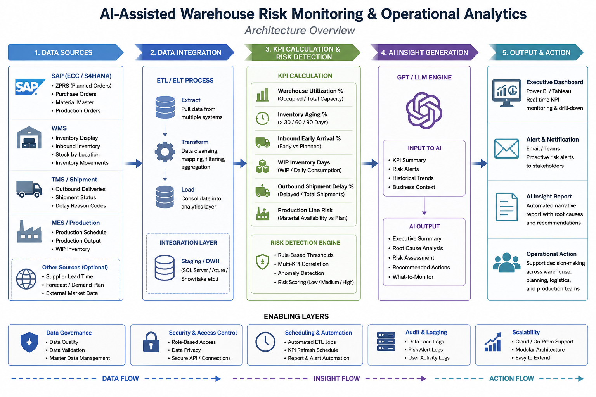
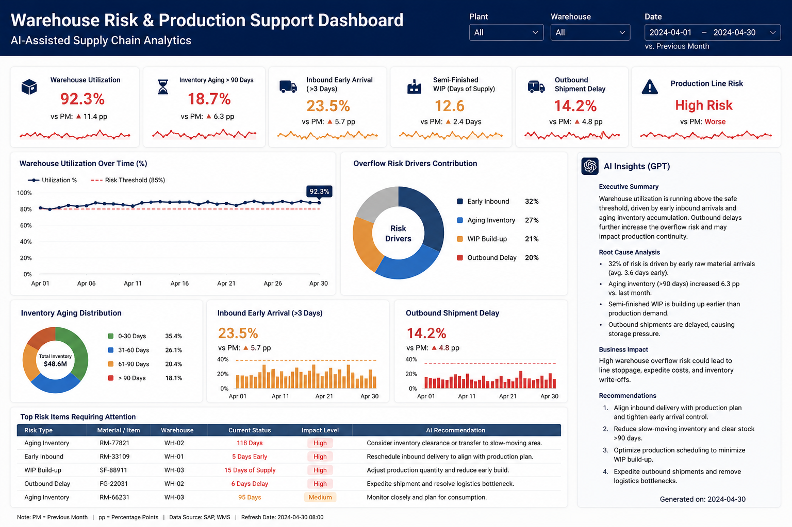

# AI-Assisted Warehouse Risk & Production Support Analytics

## Overview

This project demonstrates a conceptual AI-assisted analytics workflow designed to improve warehouse risk visibility and support operational decision-making in a manufacturing supply chain environment.

The workflow combines SAP/WMS operational KPIs, Python-based automation, GPT-powered operational insight generation, and executive-style dashboard reporting to proactively identify warehouse overflow risks and potential production disruptions.

---

## Business Context

During warehouse operations support in a manufacturing environment, warehouse overflow risk was a recurring operational challenge that could potentially impact production continuity and downstream operational efficiency.

The root causes were often cross-functional and difficult to identify quickly, including:

- Early raw material arrivals
- Aging and slow-moving inventory
- Semi-finished goods buildup
- Outbound shipment delays

Operational signals were fragmented across multiple systems, making proactive monitoring and root cause analysis difficult.

---

## Solution Approach

To improve operational visibility, a conceptual AI-assisted analytics workflow was designed to:

- Monitor critical warehouse and supply chain KPIs
- Detect operational risk signals
- Consolidate fragmented operational data into centralized reporting
- Generate GPT-powered operational insights
- Support faster root cause identification and decision-making

---

## Workflow Architecture

---

## Dashboard Preview

---

## Example KPI Areas

- Warehouse utilization monitoring
- Inventory aging analysis
- Inbound early arrival tracking
- Semi-finished goods accumulation
- Outbound shipment delay monitoring
- Production line risk visibility

---

## AI Insight Layer

The workflow uses GPT-powered operational insight generation to transform KPI anomalies into:

- Executive summaries
- Root cause analysis
- Operational risk alerts
- Actionable recommendations

Example AI-generated insight:

> Rising inventory aging and shipment delays are increasing warehouse overflow risk and may impact production continuity.

---

## Tech Stack

- Python
- SQL
- OpenAI API
- SAP / WMS Operational Data
- Power BI (conceptual dashboard prototype)

---

## Project Type

Conceptual Portfolio Project

This project is intended to demonstrate AI-assisted supply chain analytics concepts and operational workflow design. Dashboard visuals and workflows are illustrative prototypes and do not contain proprietary company data.
